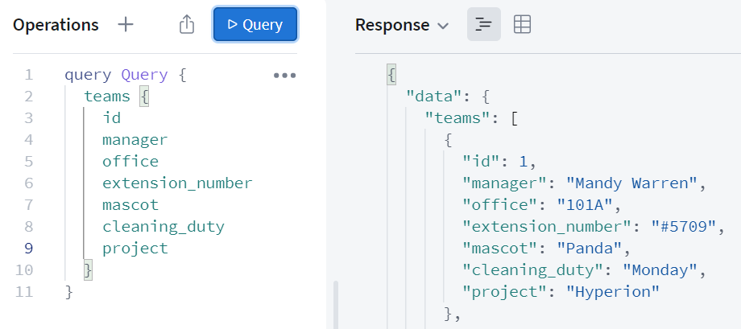

# GraphQL 기초

## GraphQL

* 페이스북에서 만든 쿼리 언어로 sql과 같은 쿼리 언어이지만 구조의 차이가 존재.
* gql(graphQL)은 웹 클라이언트가 서버로부터 데이터를 효율적으로 가져오는 것이 목적.
* sql은 백엔드에서 주로 작성하지만, gql의 경우 주로 클라이언트 시스템에서 작성, 호출.
* OverFetching, UnderFetching

.png>)


graphQL을 적용한 기업



### GraphQL vs RestAPI

* RestAPI
  * URL, Method(get,post,...)을 통한 다양한 Endpoint가 존재.
  * Endpoint에 따른 DB SQL 쿼리.
  * OverFetching, UnderFetching의 발생.
* gql
  * 단 하나의 Endpoint가 존재.
  * gql 스키마의 타입에 따른 DB SQL 쿼리.
  *   OverFetching, UnderFetching에서 RestAPI에 비해 유리하다.

      (OverFetching : 불필요한 데이터가 포함됨 / UnderFetching : 여러번의 API 호출)

.png>)

### GraphQL 구조

* 쿼리(query) : DB 데이터 get(R).
*   뮤테이션 (mutation) :  DB 데이터 수정(C,U,D).

    (RESTAPI와 같은 개념적인 규약)




### GraphQL을 위한 라이브러리

GraphQL은 (명세, 형식) 쿼리 언어로 구현할 솔루션이 필요하다.

* 백엔드에서 정보를 제공 및 처리
* 프론트엔드에서 요청 전송

이를 위한 라이브러리로는 GraphQL.js, GraphQL Yoga, AWS Amplift, ...

#### Apollo GraphQL

* 백엔드와 프론트엔드 모두 제공
* 간편하고 쉬운 설정(위 request, response 화면 참고)


### 스키마/타입 (schema/type)

```
const { ApolloServer, gql } = require('apollo-server')
const database = require('./database')

/**
 * typeDef
 * GraphQL 명세에서 사용될 데이터, 요청 타입 지정
 * gql (template literal tag) 로 생성됨
 */ 
const typeDefs = gql`
type Query {
    teams: [Team]
    }
type Team {
    id: Int
    manager: String
    office: String
    extension_number: String
    mascot: String
    cleaning_duty: String
    project: String
  }
  
 /**
 * resolver
 * 서비스의 액션들을 함수로 지정
 * 요청에 따라 데이터를 반환, 입력, 수정, 삭제
 */
 const resolvers = {
  Query: {
    teams: () => database.teams
    .map((team) => {
      team.supplies = database.supplies
      .filter((supply) => {
          return supply.team === team.id
      })
      return team
    })
}

// ApolloServer : typeDef와 resolver를 인자로 받아 서버 생성
const server = new ApolloServer({ typeDefs, resolvers })
server.listen().then(({ url }) => {
console.log(`🚀  Server ready at ${url}`)
})
```

#### 오브젝트 타입과 필드

* 오브젝트 타입 : Team&#x20;
* 필드 : id, manager, office, ...
* 스칼라 타입 : String, ID, Int 등
* 느낌표(!) : 필수 값을 의미(non-nullable)
* 대괄호(\[, ]) : 배열을 의미(array)


### 마침

리팩토링에서 사용하기 위한 정리.

Overfetching과 Underfetching에서 장점을 가져가는 부분에서 RestAPI에 비해 Back과 Front의 협업이 한층 수월해 질 것으로 보인다. 기존 response의 형태를 Back에서 전적으로 가지고 있던 것에 대해 그 영역이 Front로 넘어간 것으로 같은 기능에 대해 반복적인 개발도 줄어들 것으로 예상된다.


### 참고

* [https://tech.kakao.com/2019/08/01/graphql-basic/](https://tech.kakao.com/2019/08/01/graphql-basic/)
* [https://www.yalco.kr/lectures/graphql-apollo/](https://www.yalco.kr/lectures/graphql-apollo/)
* [얄팍한 GraphQL과 Apollo](https://www.inflearn.com/course/%EC%96%84%ED%8C%8D%ED%95%9C-graphql-apollo/dashboard)

